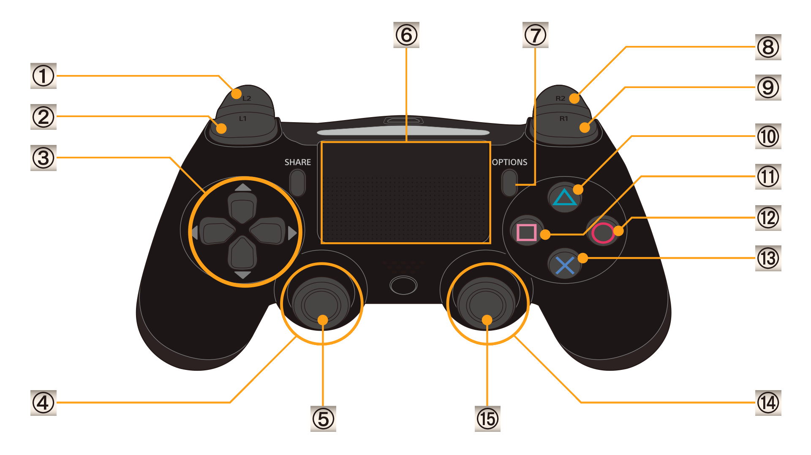

# 

A boy dreams of being a superhero. One day, when he gets bitten by a fly, his dream comes true. However, nothing turned out the way he imagined!

## What is Flyboy?

Flyboy is a metroidvania game based on platforming and combat mechanics. We hope to create a beautiful game with hand drawn scenarios and characters with clumsy energetic jazz music. Based on the real-world hazards for flies, we’ll create bosses that will provide the players with relatable situations which can range from funny to ludicrous. Every boss will have different way of defeating it and, with unlockable, customizable abilities and weapons, players will follow the story of a young little boy who dreamt of becoming a superhero.

## Try it

If you want to try out the game, feel free to grab a copy of the binaries from the releases page and try it out. Just make sure you play it with a controller!

If you have any sugestions for the game let us know what you think of it!

## Controls

2. Cycle Weapons
5. Move/Aim
7. Pause
8. Shoot
9. Activate S.U.P.E.R.
11. Dash
13. Jump
